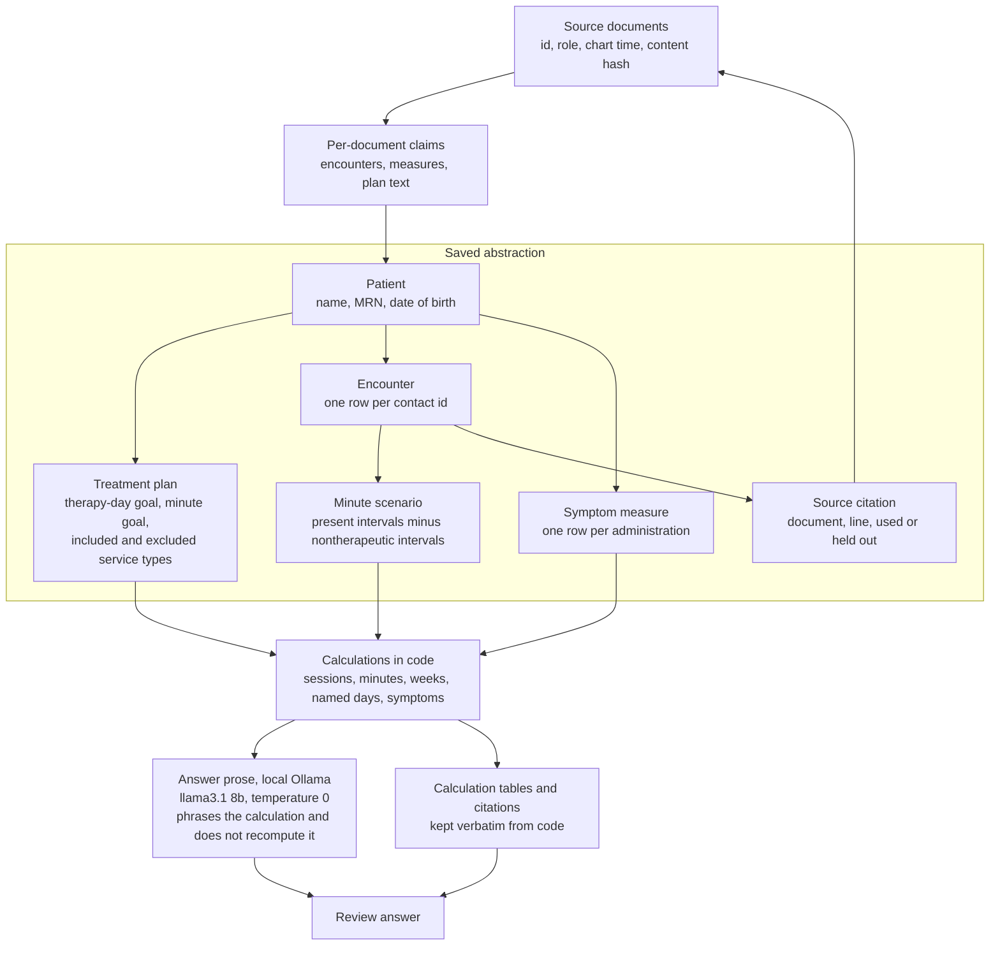

# Clinical chart abstraction

This prototype reads the notes in `documents/`, saves one abstraction per patient, and answers review questions from that file. Totals are computed in code. A local model only phrases the finished calculation.

## Setup

Python 3.11 or newer. The package uses the standard library. Answer phrasing uses a local [Ollama](https://ollama.com) server at `http://127.0.0.1:11434`.

```bash
ollama pull llama3.1:8b
python3 -m src process --input documents --output out --questions questions.json
```

That writes:

- `out/abstraction.json` — the saved abstraction
- `out/abstraction.mmd` — the diagram below
- `out/answers/` — the five development answers, with calculations and sources, plus `timing.json`
- `out/execution.log`
- `out/benchmarks.json`
- `out/design_experiment.json`

New questions reuse the saved abstraction and do not rebuild it:

```bash
python3 -m src answer --abstraction out/abstraction.json --questions questions.json --output out/answers
python3 -m src ask "Which patients had two consecutive weeks below the treatment plan requirements?"
python3 -m src query minutes
```

`--no-narrate` keeps the code-written calculation as the whole answer. `--model` selects another local model. `qwen3:4b-instruct` is installed here and is the faster alternative; it is not the default.

```bash
python3 -m unittest discover -s tests
```

## Approach

Each file becomes claims: encounter, clock intervals, disposition, symptom score, or plan goal, with the document id and line. Claims about the same encounter id are one contact. A correction replaces the field it names. A retransmission, unsigned draft, or posted charge stays in the audit trail and stays out of the arithmetic. Two final notes that disagree, and neither of which corrects the other, stay a range.

Therapy minutes are patient-present time in individual, group, or family psychotherapy, minus intervals the note calls nontherapeutic (group breaks, a dropped video connection, time before the patient joined a family visit). A second count keeps the break, because the plan’s phrase is “patient-present.” Week goals are met only when both readings meet them.



The narrator receives the question and the code-written calculation. It does not receive the chart. If its paragraph drops a headline figure, that paragraph is discarded and the code-written answer stands alone. On this run all five paragraphs kept the required figures (`model_fallback_count` is 0 in `out/benchmarks.json`). The calculation section is always appended, so the sources do not depend on the model.

`llama3.1:8b` is the narrator because unresolved ranges have to be repeated exactly. `qwen3:4b-instruct` (Q4_K_M) would be the choice when a shorter wait matters more than that. Extraction does not call a model: the same parser has to be cheap across a large chart.

## Design decision tested

I compared “the latest chart document wins” with explicit authority. Both policies ran on the same extracted claims (`out/design_experiment.json`).

Latest-document-wins treats the January 26 retransmission of the January 19 roster (BH-D104) as a new attendance fact. That puts Rowan’s departure back at 11:30, so the group contact is 75 minutes instead of 60 after the January 20 correction (BH-D103). It also picks Nora Ellis’s later January 26 note (40 minutes) and drops Mira Patel’s 50-minute note. The episode total becomes a single 600 minutes. Under explicit authority it stays 585–595, because those two notes are both final and neither corrects the other.

The week labels did not all flip. The week of January 26 is still “cannot be determined” once breaks are counted as present time. What changed is the contact reading of that week: an unresolved 145–155 minutes became a determined 145, which misses 150. A later file is not a better file. Corrections apply only where they say what they replace, and an unresolved disagreement stays visible.

## Limitation, and what to look at next

The plan requires 150 patient-present minutes and does not say whether a break the patient sat through counts. The week of January 5 is 140 minutes with the break removed and 155 with it kept, so that week’s goal flips. The same choice decides whether January 5 and January 12 are two consecutive shortfall weeks. Next I would look for a program attendance rule, or a plan addendum, that defines the minute. The January 26 start time needs a contemporaneous arrival record of the kind the January 19 correction already cites.

The parser is built for this chart’s labels (`Patient arrival`, `Nontherapeutic break`, `PHQ-9 total`). A differently formatted note would be stored without a clock interval and the minute total would be short. I would run the same pipeline on a held-out batch of notes in this style and compare extracted intervals to a manual abstract, then widen the label list only where that comparison misses a real interval.

## First bottleneck at a million documents

Not the answer model. Phrasing happens once per question, after the abstraction exists. Five questions on this chart took 76 seconds and cost $0, whatever the chart size.

The first cost is building the abstraction. A cold read of these 31 files, with no extraction cache, took 0.027 seconds. `out/benchmarks.json` records a later run at 0.0068 seconds because all 31 extractions were cache hits; its million-document extrapolation (about 218 seconds) is that reload, not a first ingest. Scaling the cold measurement linearly gives about 870 seconds of parsing, and the JSON abstraction would be on the order of 3.5 GB if each file stays this dense (107,801 bytes for 31 files). Both figures are estimates, not measurements at that scale.

The constrained code is `load_extractions` plus writing one `abstraction.json`. Reruns already skip unchanged files by content hash. At a million files I would shard extraction and store encounters in SQLite or Parquet keyed by patient and date, and answer collection questions from that store instead of loading one JSON object. If extraction itself moved to a model, that cost would come first: one local call per document, not per question.

## Model, assistance, runtime, cost

| Item | Value |
| --- | --- |
| Answer model | Ollama `llama3.1:8b` (Q4_K_M), local |
| Settings | temperature 0, top_p 0.9, num_ctx 8192, num_predict 900 |
| Calls on this run | 5, all accepted, 6,277 tokens counted by Ollama |
| Other installed model considered | `qwen3:4b-instruct` (Q4_K_M), not used for these answers |
| Extraction model | none |
| Model cost | $0 |
| Cold extract | 0.027 s for 31 files |
| Cached extract + reconcile | 0.007 s + 0.0003 s (`out/benchmarks.json`) |
| Five patient questions | 76 s, about 12–20 s each |
| Collection question (consecutive shortfall weeks) | under 0.001 s, no model call |
| Abstraction size | 107,801 bytes |
| Coding assistance | Cursor’s coding agent (Auto) drafted and revised this implementation in Cursor. Calculations were checked against the notes and `tests/test_review.py`. |
